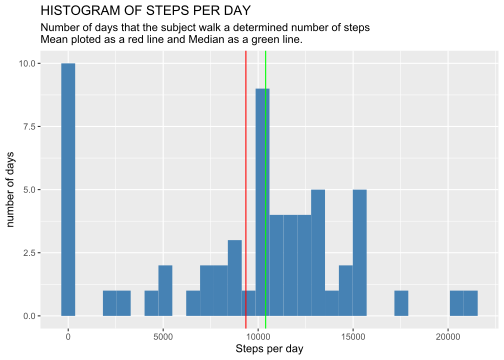
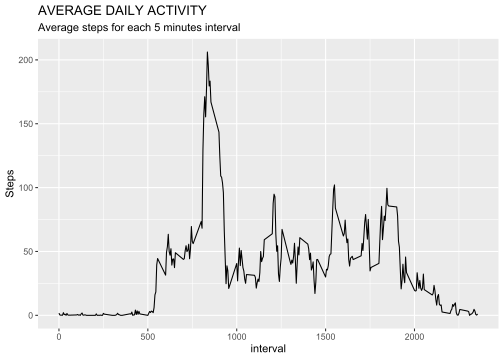
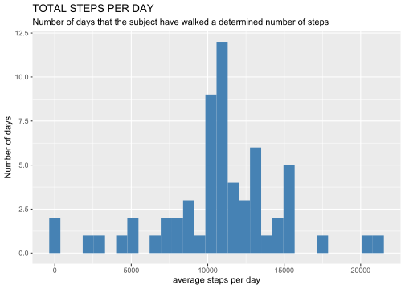
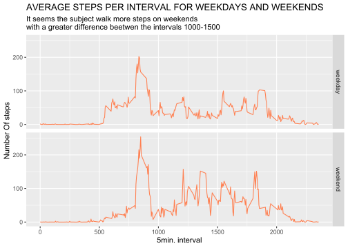

## Loading and preprocessing the data

This chunk is for loading the data, and some useful libraries. I hide the results because there is a lot of text generated by charging the libraries and there is no real output that worth looking at.


```r
activity <- read.csv("activity.csv")
library(dplyr)
library(lubridate)
library(ggplot2)
activity$date <-ymd(activity$date) 
activity <- as_tibble(activity)
```

## What is mean total number of steps taken per day?

processing the data


```r
stepsxday <- activity %>% 
    group_by(date) %>% 
    summarise(total_steps = sum(steps, na.rm=T))
```

Presenting the data as histogram


```r
stepsxday %>% 
    ggplot(aes(total_steps))+
    geom_histogram(fill="steelblue")+
    labs(title = "HISTOGRAM OF STEPS PER DAY", x = "Steps per day", y = "number of days" ,subtitle = "Number of days that the subject walk a determined number of steps \nMean ploted as a red line and Median as a green line.")+
    geom_vline(xintercept =mean(stepsxday$total_steps), colour="red")+
    geom_vline(xintercept = median(stepsxday$total_steps),  colour="green")
```

```
## `stat_bin()` using `bins = 30`. Pick better value with `binwidth`.
```

<!-- -->

this code gets the mean and the median of total steps per day


```r
mean_stp <- mean(stepsxday$total_steps, na.rm=T)
median_stp <- median(stepsxday$total_steps, na.rm=T)
```

the mean steps per day is 9354.2295082 and the median value is equal to 10395.

## What is the average daily activity pattern?

getting the adequate data and plotting the results


```r
activity %>% 
    group_by(interval) %>% 
    summarise(avg_stp = mean(steps, na.rm=T)) %>% 
    ggplot(aes(interval, avg_stp))+
    geom_line()+
    labs(title = "AVERAGE DAILY ACTIVITY", y="Steps", subtitle = "Average steps for each 5 minutes interval")
```

<!-- -->


```r
activity %>% 
    group_by(interval) %>% 
    summarise(avg_stp = mean(steps, na.rm=T)) %>% 
    filter(avg_stp==max(avg_stp))
```

```
## # A tibble: 1 × 2
##   interval avg_stp
##      <int>   <dbl>
## 1      835    206.
```

## Imputing missing values

Calculate the number of NA values in the data set


```r
casosna <- activity %>%
    mutate(complete = complete.cases(activity)) %>% 
    filter(complete == FALSE)
NAs <- nrow(casosna)
```

the database has a total of 2304 cases with NA Values

Replace the NA values with the mean for the respective interval


```r
Avg_Stp_DF <- activity %>% 
    group_by(interval) %>% 
    summarise(avg_stp = mean(steps, na.rm=T))
activityNARM <- activity
activityNARM$steps<-as.numeric(activityNARM$steps)
for(i in 1:nrow(activityNARM)){
    if(is.na(activityNARM[i,1])){
        x<-activityNARM[i,3]
        y<-filter(Avg_Stp_DF, interval==x$interval)
        activityNARM[i,1] <- y[1,2]
    }
}
```

Plotting the steps in a histogram


```r
Total_stp_day <- activityNARM %>% 
    group_by(date) %>% 
    summarise(Steps = sum(steps))
ggplot(Total_stp_day, aes(Steps))+geom_histogram(fill="steelblue")+
    labs(x="average steps per day", y="Number of days",subtitle = "Number of days that the subject have walked a determined number of steps", title = "TOTAL STEPS PER DAY")
```

```
## `stat_bin()` using `bins = 30`. Pick better value with `binwidth`.
```

<!-- -->


```r
total_stp_mean <- round(mean(Total_stp_day$Steps), 0)
total_stp_median <- round(median(Total_stp_day$Steps), 0)
```

The mean of the total steps per day is 1.0766\times 10^{4} and the median is 1.0766\times 10^{4} steps.

## Are there differences in activity patterns between weekdays and weekends?

generate a variable indicating the weekday


```r
activityNARM <- activityNARM %>% 
    mutate(weekday = wday(date)) %>% 
    mutate(w_day_end = factor(weekday, levels = c(1:7), labels=c("weekday","weekday","weekday","weekday","weekday", "weekend", "weekend"))) %>% 
    select(-4)
```

Plotting the results


```r
activityNARM %>% 
    group_by(interval, w_day_end) %>% 
    summarise(avg_stp_wd = mean(steps)) %>% 
    ggplot(aes(interval, avg_stp_wd))+
    geom_line(colour="coral")+
    facet_grid(w_day_end~.)+
    labs(title = "AVERAGE STEPS PER INTERVAL FOR WEEKDAYS AND WEEKENDS",
         y="Number Of steps", x="5min. interval",
         subtitle = "It seems the subject walk more steps on weekends \nwith a greater difference beetwen the intervals 1000-1500 ")
```

```
## `summarise()` has grouped output by 'interval'. You can override using the
## `.groups` argument.
```

<!-- -->
